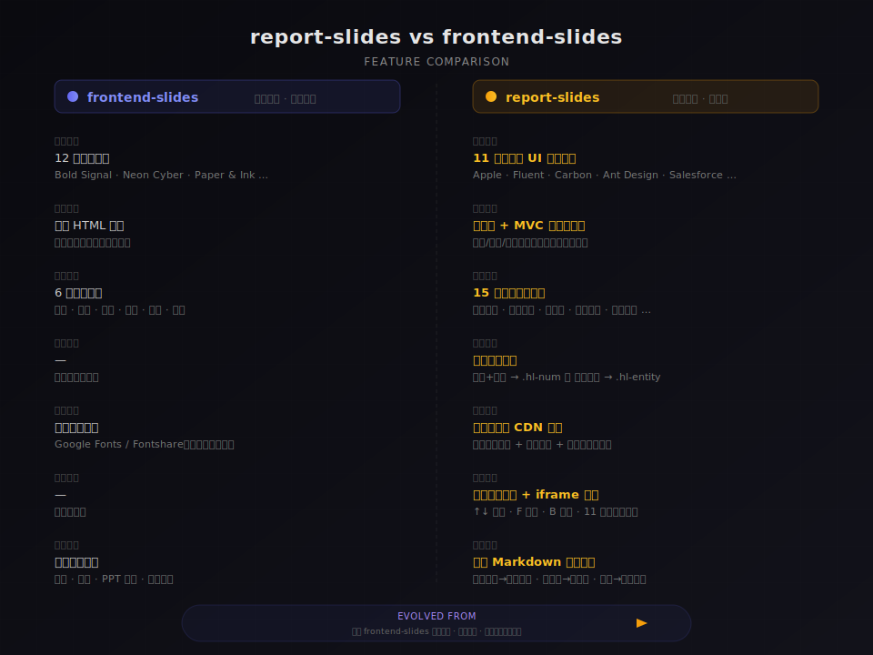

# Report Slides

将汇报原始内容（文本 / Markdown 文件）一键转换为零依赖、动画丰富的 HTML 演示文稿。

## 与 frontend-slides 的差异

> **致敬声明**：本技能的核心架构理念——零依赖单文件、100vh 视口适配、`clamp()` 响应式缩放、CSS 动画体系、`prefers-reduced-motion` 支持——均源自 [frontend-slides](../frontend-slides/SKILL.md) 的优秀设计。report-slides 站在这一基础之上，针对**中文汇报场景**进行了深度垂直扩展。



### 核心差异速览

| 维度 | frontend-slides | report-slides |
|------|----------------|---------------|
| **定位** | 通用演示（英文优先） | 🇨🇳 中文汇报专用 |
| **风格** | 12 种创意风格 | **11 种企业级 UI 设计语言** |
| **架构** | 单 HTML 文件 | 单文件 **+ MVC 画廊模式** |
| **版式** | 6 种通用版式 | **15 种汇报专用版式** |
| **高亮** | — | **自动双重高亮**（数字 + 实体） |
| **中文** | 依赖外部字体 | **钉钉进步体 CDN 内置** |
| **画廊** | — | **毛玻璃侧边栏 + iframe 预览** |
| **解析** | 通用输入 | **专用 Markdown 解析规则** |

### 继承自 frontend-slides 的能力

- ✅ 零依赖单文件输出（CSS/JS 全内联）
- ✅ 100vh 视口适配 + `overflow: hidden` 不可违反
- ✅ `clamp()` 响应式字号/间距
- ✅ 键盘导航 + 触摸滑动 + 进度条 + 导航点
- ✅ `prefers-reduced-motion` 无障碍支持
- ✅ viewport-base.css 共享基础

### 何时选择本技能

- ✅ 中文汇报、年度总结、季度复盘、战略汇报、团队述职
- ✅ 需要数据看板、关键指标高亮、多版式混排
- ✅ 需要一次性对比 11 种企业级风格
- ✅ 需要 MVC 架构方便后续维护（改文案不碰样式）
- ❌ 英文演讲、创意 pitch deck → 使用 frontend-slides
- ❌ 需要 PPT 转换或图片密集型演示 → 使用 frontend-slides

---

## 快速上手

### 这个 Skill 能做什么？

- **输入**：Markdown 文件、粘贴文本、或大纲主题
- **输出**：单个自包含 HTML 文件（零依赖，双击即可打开）
- **风格**：内置 **11 种主流 UI 设计语言**，覆盖 Apple / Google Material / Microsoft Fluent / IBM Carbon / Atlassian / Salesforce Lightning / Ant Design 等
- **交互**：键盘导航（方向键/空格）、触摸滑动、进度条、导航点
- **画廊预览**：生成风格画廊门户页面，毛玻璃侧边栏 + iframe 实时预览，↑↓ 快速切换风格

### 典型使用流程

```
用户提供内容 → 解析为幻灯片大纲 → 选择风格 → 生成 HTML → 浏览器打开
```

### 已有项目的 MVC 架构

当项目中已存在 `style-demos/` 目录时，说明采用了 MVC 分层架构，修改时需遵循分层原则：

| 层 | 文件 | 职责 | 修改场景 |
|---|---|---|---|
| **M（数据）** | `slide-data.js` | 结构化幻灯片数据（标题、内容、版式类型） | 修改文案、增删页面 |
| **V（主题）** | `demo-*.html`（11 个） | 纯 CSS 变量定义（配色、字体、间距） | 调整某个风格的视觉 |
| **C（渲染）** | `slide-renderer.js` | 根据数据 + CSS 变量动态渲染 HTML | 修改版式逻辑、组件结构 |
| **共享样式** | `slide-base.css` | 所有主题共用的布局、动画、组件样式 | 修改通用视觉效果 |
| **画廊门户** | `index.html` | 毛玻璃侧边栏 + iframe 预览 + 键盘快捷键 | 修改画廊交互 |

**修改原则**：改文案只动 `slide-data.js`，改风格只动 `demo-*.html` 的 CSS 变量，改版式逻辑只动 `slide-renderer.js`，改通用样式只动 `slide-base.css`。

### 视觉增强能力

生成的幻灯片自动具备以下视觉增强：

- **数字高亮**（`.hl-num`）：关键数字 + 单位自动使用强调色 + 粗体展示，如 `200万+`、`65%`
- **实体高亮**（`.hl-entity`）：产品名、技术术语自动添加浅色背景标签，如 `OpenYida`、`MCP Server`、`NPS`
- **文本精简**：所有文本遵循字数硬限制（标题 ≤15 字、要点 ≤20 字），确保视觉动线高效

---

## 安装

### 自动安装（推荐）

对 AI Agent 说：

```
帮我安装 report-slides skill，来源：https://github.com/openyida/skills-market/tree/main/skills/report-slides
```

Agent 会自动执行以下步骤：
1. 从 GitHub 下载 `report-slides` 文件夹中的所有文件
2. 将文件夹复制到 `~/.claude/skills/report-slides/`（Claude）或 `~/.aone_copilot/skills/report-slides/`（Aone Copilot）
3. 安装完成后即可使用

### 手动安装

```bash
# 克隆仓库
git clone https://github.com/openyida/skills-market.git /tmp/skills-market

# 复制到 Claude skills 目录
cp -r /tmp/skills-market/skills/report-slides ~/.claude/skills/

# 或复制到 Aone Copilot skills 目录
cp -r /tmp/skills-market/skills/report-slides ~/.aone_copilot/skills/
```

安装完成后，重启 Agent 或刷新 skills 列表即可使用。

---

## 核心原则

1. **零依赖** — 单个 HTML 文件，CSS/JS 全部内联，无需 npm 或构建工具
2. **内容驱动** — 用户提供原始内容或 .md 文件，自动解析并生成幻灯片结构
3. **风格可选** — 内置 11 种主流 UI 设计语言预设，用户可直接选择或预览后选择
4. **视口适配（不可妥协）** — 每张幻灯片必须精确适配 100vh，禁止滚动。内容溢出时自动拆分为多张
5. **视觉动线优化** — 文本精简、数字前置、实体高亮，确保观众 2 秒内捕捉关键信息

## 字体规范

所有风格默认使用**钉钉进步体**作为中文字体，通过 CDN 分片加载：

```html
<link rel="stylesheet" href="https://cdn.jsdelivr.net/npm/cn-fontsource-ding-talk-jin-bu-ti-regular@1.0.3/font.css">
```

CSS 中字体名称为 `'DingTalk JinBuTi'`，回退链：`'PingFang SC', 'Microsoft YaHei', sans-serif`。

---

## Phase 1: 输入解析

### Step 1.1: 确定输入方式

用户可能通过以下方式提供内容：

- **方式 A：指定 .md 文件路径** — 读取文件，按 [md-parsing.md](md-parsing.md) 规则解析
- **方式 B：直接粘贴文本** — 将文本视为 Markdown 格式解析
- **方式 C：提供大纲/主题** — 需要 AI 协助补充内容

### Step 1.2: 解析 Markdown 内容

读取 [md-parsing.md](md-parsing.md) 了解 Markdown 到幻灯片的映射规则。核心规则：

- `# 一级标题` → 封面页标题
- `## 二级标题` → 新的章节/幻灯片标题
- `### 三级标题` → 幻灯片内的子标题
- 列表项 → 要点/卡片内容
- 表格 → 数据看板或对比表
- `---` 分隔线 → 强制分页
- 加粗数字（如 `**4000万+**`）→ 自动识别为关键指标，使用大字号 + 强调色展示
- 引用块 `>` → 总结/金句页

### Step 1.3: 生成幻灯片大纲

解析完成后，向用户展示生成的幻灯片大纲：
- 每张幻灯片的标题和版式类型
- 总页数
- 询问是否需要调整

---

## Phase 2: 风格选择

### Step 2.0: 选择方式

向用户提供两种选择路径：

- **"直接选择"** — 从预设列表中选择（推荐，效率最高）
- **"预览后选择"** — 生成 2-3 个风格预览页面，在浏览器中对比后选择

### Step 2.1: 预设风格列表

可用风格定义在 [STYLE_PRESETS.md](STYLE_PRESETS.md) 中。快速参考：

| 风格 | 视觉基调 | 适用场景 |
|------|----------|----------|
| **Apple** | 极简留白、毛玻璃、柔和渐变 | 高管汇报、产品发布 |
| **Google Material** | Material You 色彩、tonal 卡片、明快 | 技术汇报、团队复盘 |
| **Neon Cyber** | 深色科技感、霓虹高光 | 技术方向、创新项目 |
| **Swiss Modern** | 瑞士风格、网格、红色强调 | 数据驱动、精确汇报 |
| **Dark Botanical** | 暗色优雅、暖色调 | 品牌汇报、设计团队 |
| **Paper & Ink** | 编辑风、文学感 | 思考型汇报、战略分析 |
| **Microsoft Fluent** | 光影通透、液态玻璃、沉浸式 | 跨端应用、Office/Azure |
| **IBM Carbon** | 理性严谨、黑白灰蓝、高信息密度 | 大数据后台、云计算、金融 |
| **Atlassian** | 活泼协作、鲜艳色彩、内容优先 | 团队协作、项目管理 |
| **Salesforce Lightning** | 业务流驱动、高密度、专业蓝 | CRM/ERP、销售、客服 |
| **Ant Design** | 确定性与幸福感、蓝色主色 | 中后台系统、出海企业 |

### Step 2.2: 预览模式（可选）

如果用户选择预览：

1. 基于用户内容的第一页（封面）和一个数据页，生成 2-3 个风格预览
2. 保存到 `.claude-design/slide-previews/` 目录
3. 在浏览器中打开供用户对比
4. 用户选择后删除预览文件

---

## Phase 3: 生成演示文稿

### Step 3.1: 按需读取支撑文件

根据生成模式按需读取文件，避免不必要的上下文占用：

**所有模式必读（核心文件）：**
- [STYLE_PRESETS.md](STYLE_PRESETS.md) — 选定风格的完整 CSS 变量、字体、配色
- [viewport-base.css](viewport-base.css) — 必须完整内联到 HTML 中的视口适配 CSS
- [html-template.md](html-template.md) — HTML 架构、JS 功能、代码质量标准
- [animation-patterns.md](animation-patterns.md) — 动画参考

**单文件生成模式额外读取：**
- [slide-data-schema.md](slide-data-schema.md) — 15 种版式类型定义（用于理解数据结构）
- [slide-base-css.md](slide-base-css.md) — 共享基础样式（版式布局、高亮组件、卡片、badge 等）

**多风格画廊模式额外读取：**
- [slide-data-schema.md](slide-data-schema.md) — 结构化数据源的 JSON Schema
- [slide-renderer-template.md](slide-renderer-template.md) — 渲染引擎模板代码（含 highlightText、15 种版式渲染方法、SlidePresentation 控制器）
- [slide-base-css.md](slide-base-css.md) — 共享基础样式
- [gallery-template.md](gallery-template.md) — 画廊门户 HTML 模板（毛玻璃侧边栏 + iframe 预览 + 键盘快捷键）

> **优化说明**：单文件模式下无需读取 `slide-renderer-template.md`（739 行）和 `gallery-template.md`（605 行），可节省约 1300 行上下文。

### Step 3.2: 版式映射

共 15 种版式类型，根据内容类型自动选择最佳版式。完整数据结构定义见 [slide-data-schema.md](slide-data-schema.md)。

| 版式 type | 内容类型 | 最大容量 |
|-----------|----------|----------|
| `cover` | 封面（标题 + 副标题 + 关键词云） | 1 标题 + 1 副标题 + 可选关键词标签 |
| `toc` | 目录导航 | 1 标题 + 最多 6 个章节项 |
| `metrics-dashboard` | 关键指标数据看板 | 1 标题 + 最多 8 个指标（4×2 网格） |
| `two-col` | 双栏内容（左右并列） | 1 标题 + 左右各 1 卡片（含列表） |
| `two-col-with-flow` | 双栏 + 底部流程图 | 1 标题 + 左右各 1 卡片 + 1 流程行 |
| `two-col-priority` | 双栏优先级（左大右小） | 1 标题 + 左侧主卡片 + 右侧 2 小卡片 |
| `quadrant` | 四象限卡片网格 | 1 标题 + 4 张卡片（2×2） |
| `quadrant-badges` | 四象限 + 徽章标签 | 1 标题 + 4 张卡片（含 badge 颜色） |
| `issues` | 问题/挑战列表 | 1 标题 + 最多 4 个问题卡片 |
| `pyramid` | 金字塔层级结构 | 1 标题 + 3 层（顶/中/底） |
| `three-strategy` | 三列策略/支柱 | 1 标题 + 3 列内容 |
| `indicators` | 指标分组展示 | 1 标题 + 2-3 个指标组 |
| `support` | 资源/支持需求 | 1 标题 + 最多 4 张支持卡片 |
| `summary` | 总结/展望 | 1 标题 + 高亮框 + 可选箭头 |
| `qa` | Q&A 结束页 | 大字标题 + 副标题 |

**内容超出限制？拆分为多张幻灯片。绝不压缩，绝不滚动。**

### Step 3.2.5: 文本精简规范（视觉动线优化）

幻灯片不是文档，观众用"扫"而非"读"来获取信息。每条文本必须在 **一次视觉扫描（≈2秒）** 内完成信息传递。

#### 字数硬限制

| 文本类型 | 中文上限 | 英文上限 | 超限处理 |
|----------|----------|----------|----------|
| 幻灯片标题 | ≤15 字 | ≤8 words | 拆分为标题 + 副标题 |
| 副标题/描述 | ≤25 字 | ≤15 words | 删减修饰语，保留核心动词+名词 |
| 列表要点 | ≤20 字 | ≤12 words | 拆为两条或精简 |
| 卡片描述 | ≤20 字 | ≤12 words | 同上 |
| 高亮框/金句 | ≤25 字 | ≤15 words | 提炼为"判断句"而非"论述句" |

#### 精简手法

将冗长句子转化为"关键词 + 短语"结构：

| ❌ 原文（36字） | ✅ 精简后（16字） |
|---|---|
| 关键不是继续局部加 AI，而是完成产品定位、供给生态和商业路径的整体重构 | 全面重构定位·生态·商业路径 |
| 虽然缺乏专门运营资源，但通过主动补位与前线协同，完成了社区从 0 到 1 启动 | 零资源补位，社区从 0 到 1 |
| AI 从单点功能进入社区、模板、工具链和 Skill 生态，形成平台雏形 | AI 渗透社区·模板·工具链·Skill |

**精简原则：**
1. **删连词**：去掉"虽然…但是…"、"不是…而是…"、"通过…完成…"等句式骨架
2. **删修饰**：去掉"持续"、"进一步"、"显著"、"整体"等副词/形容词
3. **用符号代替文字**：用 `→`（导致/转化）、`·`（并列）、`+`（组合）、`/`（或）替代连接词
4. **保留核心动宾**：每条要点只保留一个核心动作 + 一个核心对象
5. **数字前置**：将关键数字放在句首，如 "NPS 46→51" 而非 "NPS 从 46 提升至 51"

#### 自检清单

生成内容后，逐条检查：
- [ ] 是否有超过 20 字的列表要点？→ 必须精简
- [ ] 是否有超过 15 字的标题？→ 必须拆分或缩短
- [ ] 是否存在"不是 A 而是 B"句式？→ 直接写 B
- [ ] 是否存在"通过 X 完成 Y"句式？→ 直接写 "X → Y"
- [ ] 数字是否在句尾？→ 移到句首

### Step 3.3: 关键指标处理

识别到关键数据指标时（如 `4000万+`、`3000人`、`581`）：

- 使用大字号展示：`font-size: clamp(1.5rem, 4vw, 3.5rem)`
- 添加 `white-space: nowrap` 防止换行
- 使用风格对应的强调色
- 数字与单位/后缀保持在同一行

### Step 3.4: 生成要求

- 单个自包含 HTML 文件，所有 CSS/JS 内联
- 完整包含 viewport-base.css 的内容
- 使用钉钉进步体 + 风格指定的英文字体
- 每个章节添加清晰的 `/* === SECTION NAME === */` 注释
- 所有字号和间距使用 `clamp()` 响应式缩放
- 包含键盘导航（方向键、空格）、触摸滑动、进度条、导航点
- 包含 `prefers-reduced-motion` 支持
- **必须实现 `highlightText()` 自动高亮**：数字+单位 → `.hl-num`，名词实体 → `.hl-entity`（参考 [slide-renderer-template.md](slide-renderer-template.md)）

---

## Phase 3.5: 多风格画廊模式（推荐）

当用户希望一次性预览所有 11 种风格效果时，采用 MVC 分层架构生成多文件画廊项目，而非单个 HTML 文件。

### 何时触发

- 用户明确要求"所有风格"、"画廊"、"多风格预览"
- 用户希望对比多种风格后再做最终选择
- 用户要求生成与 `style-demos/` 目录同等质量的完整项目

### Step 3.5.1: 生成 MVC 架构文件

读取以下支撑文件，按 MVC 架构生成完整项目：

| 文件 | 来源 | 说明 |
|------|------|------|
| `slide-data.js` | 根据用户内容生成 | **M（数据层）**：结构化幻灯片数据，遵循 [slide-data-schema.md](slide-data-schema.md) |
| `slide-renderer.js` | 按模板生成 | **C（控制层）**：渲染引擎，遵循 [slide-renderer-template.md](slide-renderer-template.md) |
| `slide-base.css` | 按模板生成 | **共享样式**：所有主题共用，遵循 [slide-base-css.md](slide-base-css.md) |
| `demo-*.html`（11 个） | 按风格预设生成 | **V（视图层）**：每个文件只含 CSS 变量，引用上述 3 个共享文件 |
| `index.html` | 按模板生成 | **画廊门户**：毛玻璃侧边栏 + iframe 预览，遵循 [gallery-template.md](gallery-template.md) |

### Step 3.5.2: 数据层生成规则

将用户内容转换为 `SLIDE_DATA` 数组，每个元素包含：

```javascript
{
    type: 'cover',           // 15 种版式之一
    sectionLabel: '01',      // 章节编号
    title: '标题',
    subtitle: '副标题',
    items: [...],            // 列表项（格式见 slide-data-schema.md）
    entityTerms: ['产品A'],  // 需要高亮的名词实体
    colorKey: 'accent'       // 颜色映射键
}
```

**关键规则**：
- `entityTerms` 数组定义在 `SLIDE_DATA` 顶部，包含所有需要高亮的产品名、技术术语
- 列表项使用 `|` 分隔标题和描述：`"标题|描述内容"`
- 颜色键映射到 CSS 变量：`accent` → `--accent-primary`，`magenta` → `--accent-magenta` 等

### Step 3.5.3: 主题文件生成规则

每个 `demo-*.html` 的结构极简：

```html
<!DOCTYPE html>
<html lang="zh-CN">
<head>
    <meta charset="UTF-8">
    <meta name="viewport" content="width=device-width, initial-scale=1.0">
    <title>[风格名] — [汇报标题]</title>
    <link rel="stylesheet" href="https://cdn.jsdelivr.net/npm/cn-fontsource-ding-talk-jin-bu-ti-regular@1.0.3/font.css">
    <link rel="stylesheet" href="[英文字体 CDN]">
    <link rel="stylesheet" href="slide-base.css">
    <style>
        :root {
            /* 从 STYLE_PRESETS.md 复制对应风格的完整 CSS 变量 */
        }
    </style>
</head>
<body>
    <script src="slide-data.js"></script>
    <script src="slide-renderer.js"></script>
    <script>SlideRenderer.render();</script>
</body>
</html>
```

**修改原则**：改文案只动 `slide-data.js`，改风格只动 `demo-*.html` 的 CSS 变量，改版式逻辑只动 `slide-renderer.js`，改通用样式只动 `slide-base.css`。

### Step 3.5.4: 输出目录结构

```
style-demos/
├── index.html              ← 画廊门户
├── slide-data.js           ← 数据源（M）
├── slide-renderer.js       ← 渲染引擎（C）
├── slide-base.css          ← 共享基础样式
├── demo-apple.html         ← Apple 主题（V）
├── demo-google.html        ← Google Material
├── demo-neon.html          ← Neon Cyber
├── demo-swiss.html         ← Swiss Modern
├── demo-botanical.html     ← Dark Botanical
├── demo-paper.html         ← Paper & Ink
├── demo-fluent.html        ← Microsoft Fluent
├── demo-carbon.html        ← IBM Carbon
├── demo-atlassian.html     ← Atlassian
├── demo-salesforce.html    ← Salesforce Lightning
└── demo-antd.html          ← Ant Design
```

---

## Phase 4: 交付

1. **清理** — 删除 `.claude-design/slide-previews/` 目录（如果存在）
2. **打开** — 使用 `open [filename].html` 在浏览器中启动
3. **告知用户**：
   - 文件位置、风格名称、幻灯片数量
   - 导航方式：方向键、空格、滚动/滑动、点击导航点
   - 自定义方式：`:root` CSS 变量改颜色、字体链接改字体、`.reveal` 类改动画

---

## 视口适配规则（不可违反）

以下规则适用于每一张幻灯片：

- 每个 `.slide` 必须有 `height: 100vh; height: 100dvh; overflow: hidden;`
- 所有字号和间距必须使用 `clamp(min, preferred, max)` — 禁止固定 px/rem
- 内容容器需要 `max-height` 约束
- 图片：`max-height: min(50vh, 400px)`
- 高度断点：700px、600px、500px
- 禁止直接取反 CSS 函数（`-clamp()` 会被静默忽略）— 使用 `calc(-1 * clamp(...))`

### 每张幻灯片内容密度上限

| 版式类型 | 最大内容 |
|----------|----------|
| 封面页 | 1 标题 + 1 副标题 + 可选标签行 |
| 内容页 | 1 标题 + 4-6 个要点 或 1 标题 + 2 段落 |
| 卡片网格 | 1 标题 + 最多 6 张卡片（2×3 或 3×2） |
| 数据看板 | 1 标题 + 最多 8 个指标（4×2） |
| 引用页 | 1 引用（最多 3 行）+ 署名 |
| 总结页 | 1 大标题 + 1 段描述 |

---

## 支撑文件

| 文件 | 用途 | 何时读取 |
|------|------|----------|
| [STYLE_PRESETS.md](STYLE_PRESETS.md) | 风格预设：配色、字体、签名元素 | Phase 2（风格选择） |
| [viewport-base.css](viewport-base.css) | 必须内联的响应式 CSS | Phase 3（单文件生成） |
| [html-template.md](html-template.md) | HTML 结构、JS 功能、代码标准 | Phase 3（单文件生成） |
| [animation-patterns.md](animation-patterns.md) | CSS/JS 动画片段和效果指南 | Phase 3（生成） |
| [md-parsing.md](md-parsing.md) | Markdown 到幻灯片的解析规则 | Phase 1（输入解析） |
| [slide-data-schema.md](slide-data-schema.md) | 结构化数据源 Schema、15 种版式类型定义 | Phase 3 / 3.5（数据层） |
| [slide-renderer-template.md](slide-renderer-template.md) | 渲染引擎模板：highlightText + 15 种版式渲染 + SlidePresentation 控制器 | Phase 3 / 3.5（控制层） |
| [slide-base-css.md](slide-base-css.md) | 共享基础样式：版式布局、高亮组件、卡片、badge | Phase 3 / 3.5（样式层） |
| [gallery-template.md](gallery-template.md) | 画廊门户模板：毛玻璃侧边栏 + iframe 预览 + 键盘快捷键 | Phase 3.5（画廊模式） |
